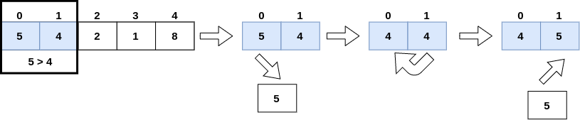

 # Bubble Sort

In this Sorting Algorithm, comparisons between the array elements of size n will be performed. Each element of position **i** will be compared with the element of position **i + 1**, When the desired ordering (ascending or descending) is found, an exchange of position of elements is performed.

